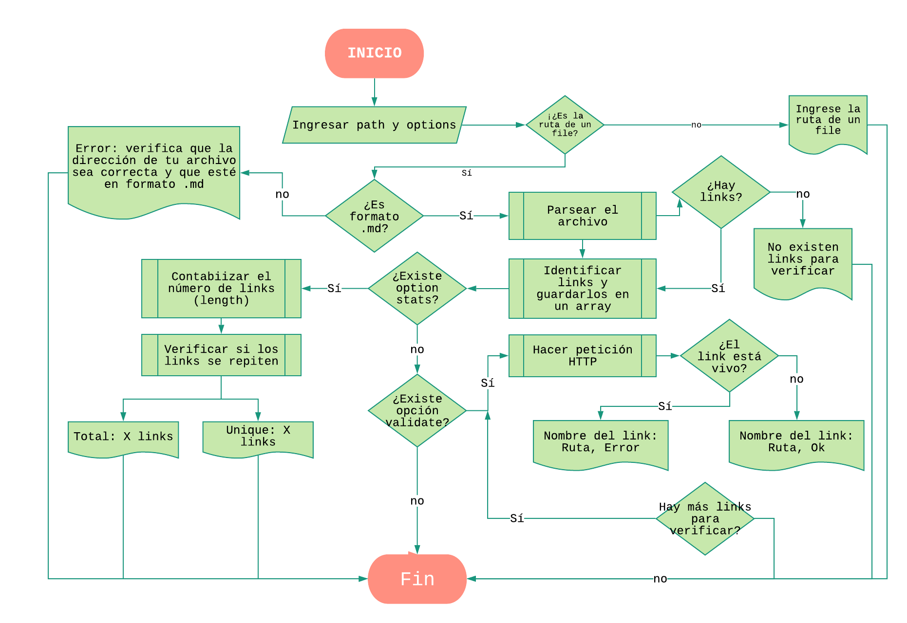

@Dionisiaca/md-links
======

Helps you verify links in your .md files

Install
------

    npm install @dionisiaca/md-links

How to use
------

To execute md-links you have to input a path (file directory) and an option:

    md-links <path-to-your-file> [options]

for example:

    md-links README.md --stats

The options available for this framework are --stats and validate.

#### Validate

    --validate 
    --v

Outputs all the urls detected on the file followed by an 'ok' or 'error' message and status code

    example.md http://thisisanurl.com ok 200
    example.md http://thisisanurl.com error 404

#### Stats

    --stats
    --s

Outputs the total number of links available in the file

    Total links: 23

Program flow
------

